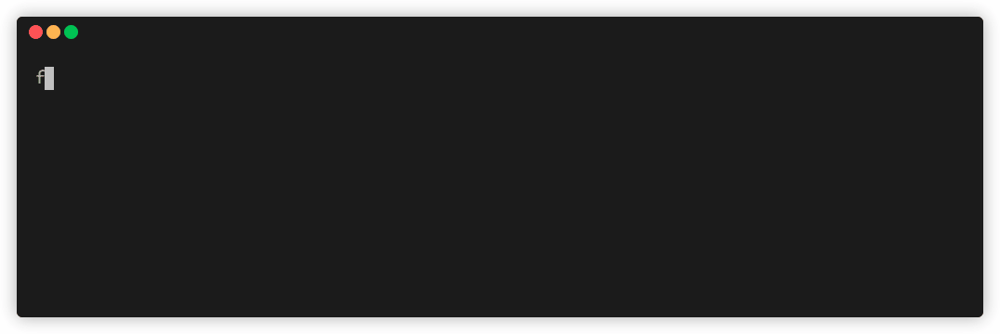

## Prerequisites

1. AWS account
2. A Lambda function to monitor

- Lambda function handler should be named `handler` and exported from a `index.js` or `index.mjs` file in the Lambda's default root diretory

3. AWS credentials in a [shared file](https://docs.aws.amazon.com/sdk-for-javascript/v2/developer-guide/loading-node-credentials-shared.html)
4. [Node.js](https://nodejs.org/en/download/)
5. [Terraform](https://developer.hashicorp.com/terraform/tutorials/aws-get-started/install-cli)
6. [Server](https://github.com/try-firefly/firefly-pipeline) accessible via an HTTPS address

Your AWS accout needs to have IAM permissions to create the following resources:

- aws_cloudwatch_metric_stream
- aws_iam_role
- aws_iam_role_policy
- aws_kinesis_firehose_delivery_stream
- aws_lambda
- aws_s3_bucket
- aws_s3_bucket_public_access_block

## Install

Install the firefly cli using `npm`. Run `npm install -g try-firefly`

<p align="center"></p>

If using Ubuntu, also run the following command replacing `username` with your username:

```
sudo chown -R username:username /usr/local/lib/node_modules/try-firefly/
```

- This will make the user the owner of the global Firefly installation

## Getting started

1. Run `firefly` to see available commands

<p align="center"></p>

2. Run `firefly init` to instrument your Lambda functions and setup a metric stream and firehose

<p align="center"></p>

3. Run `firefly destroy` to teardown the metric stream and firehose

<p align="center"></p>

The `cli` instruments functions based on region. If you have functions residing in different regions, simply run the CLI again to setup the necessary infrastructure in that region.

## Instrumentation:

The instrumentation of a Lambda will add the following Lambda Layers to Lambda:

- [AWS managed Open Telemetry Layer for JavaScript](https://aws-otel.github.io/docs/getting-started/lambda/lambda-js)
- [Firefly Layer](firefly-lambda-layer/README.md)
- Open Telemetry configuration layer
- [AWS Lambda Insights layer](https://docs.aws.amazon.com/AmazonCloudWatch/latest/monitoring/Lambda-Insights.html)
